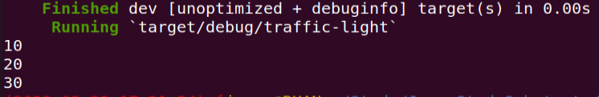
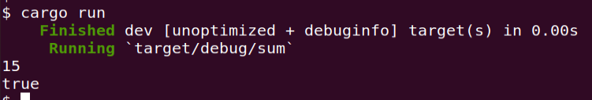
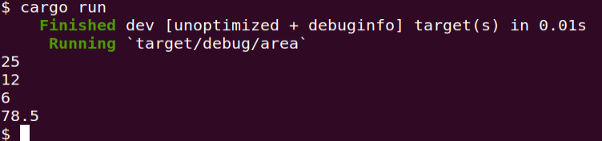

## 为枚举交通信号灯实现一个 trait，trait里包含一个返回时间的方法，不同的灯持续的时间不同

- 源码

https://github.com/lindsaylee2024/SubClass/blob/master/traffic-light/src/main.rs

- 执行结果

## 实现一个函数，为u32类型的整数集合求和，参数类型为 &[u32]，返回类型为Option，溢出时返回None

- 源码

https://github.com/lindsaylee2024/SubClass/blob/master/sum/src/main.rs

- 执行结果

## 实现一个打印图形面积的函数，它接收一个可以计算面积的类型作为参数，比如圆形，三角形，正方形，需要用到泛型和泛型约束

- 源码

https://github.com/lindsaylee2024/SubClass/blob/master/area/src/main.rs

- 执行结果

